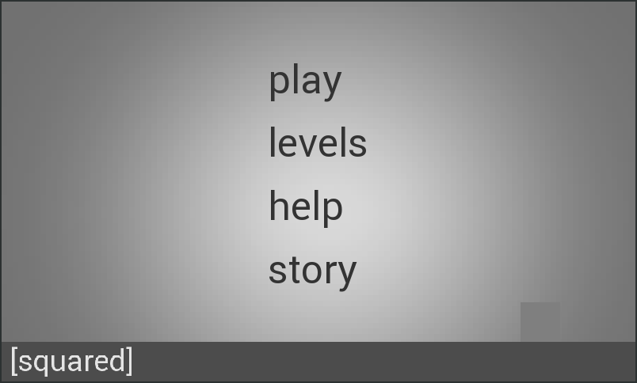
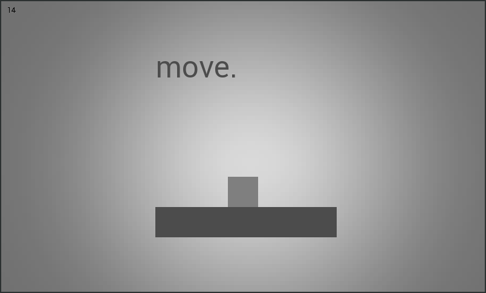

<h1>description</h1>
Small platformer game for android/desktop using LibGDX framework.

Some Screenshots: 

<h1>installation instructions</h1>
Several options: 
<ul>
<li>Download only the squared.apk (click on the squared.apk file above and click on raw on the next page) and install that to your phone.</li>
<li>Download only the squared.jar (click on the squared.jar file above and click on raw on the next page) and run that on your pc (i.e. java -jar squared.jar).</li>
<li>Clone the repo into a directory and import the folder into your preferred IDE and build it yourself (this will require changing the local.properties file).</li>
</ul>

<h1>controls</h1>
Standard WASD movement when compiling to desktop. 
<strong>touch controls</strong>
Tap on the right or left side of the screen to move in that direction. 
Tap anywhere on the screen when moving to jump. 
Tap in the middle of the screen to jump when not moving. 

<h1>todo</h1>
Game works fine as it, but still a couple things I'd like to implement.
<ul>
<li>Help and Story on the main menu need to be created.</li>
<li>Delta time need to be accounted for player movement.</li>
<li>A scoring system/save system.</li>
<li>Some sort of enemies.</li>
<li>More levels and a better level menu.</li>
<li>Better graphics.</li>
<li>App icon.</li>
</ul>
